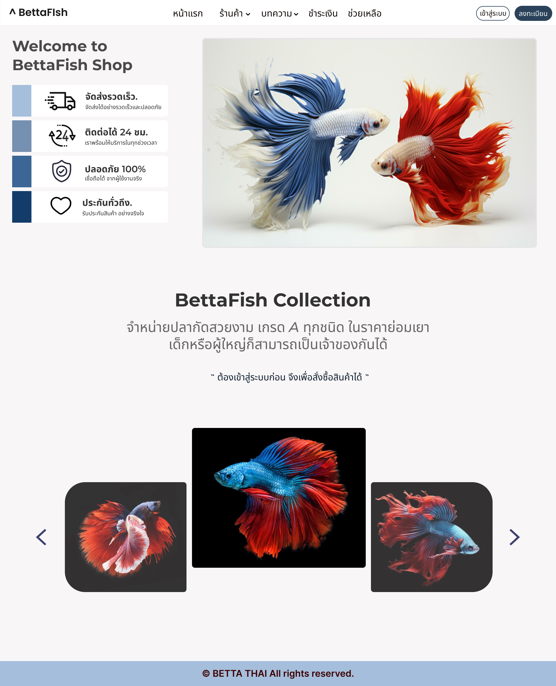
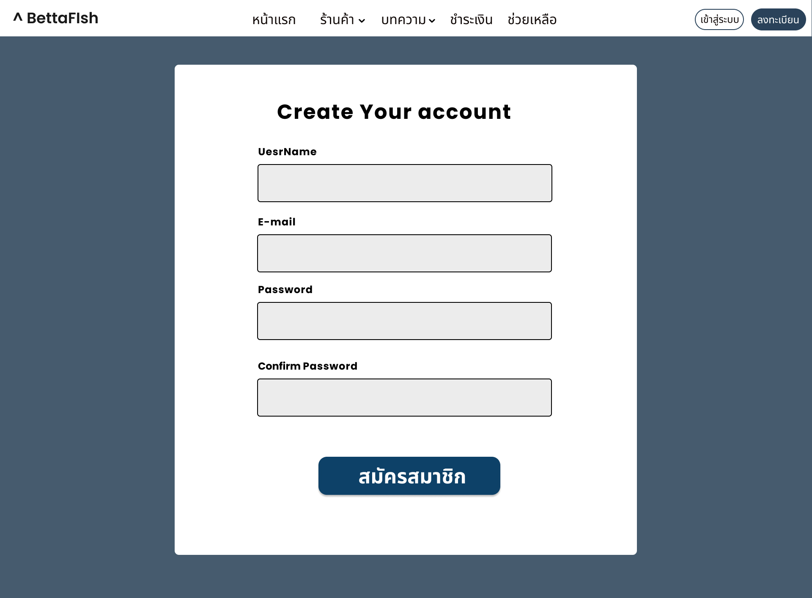
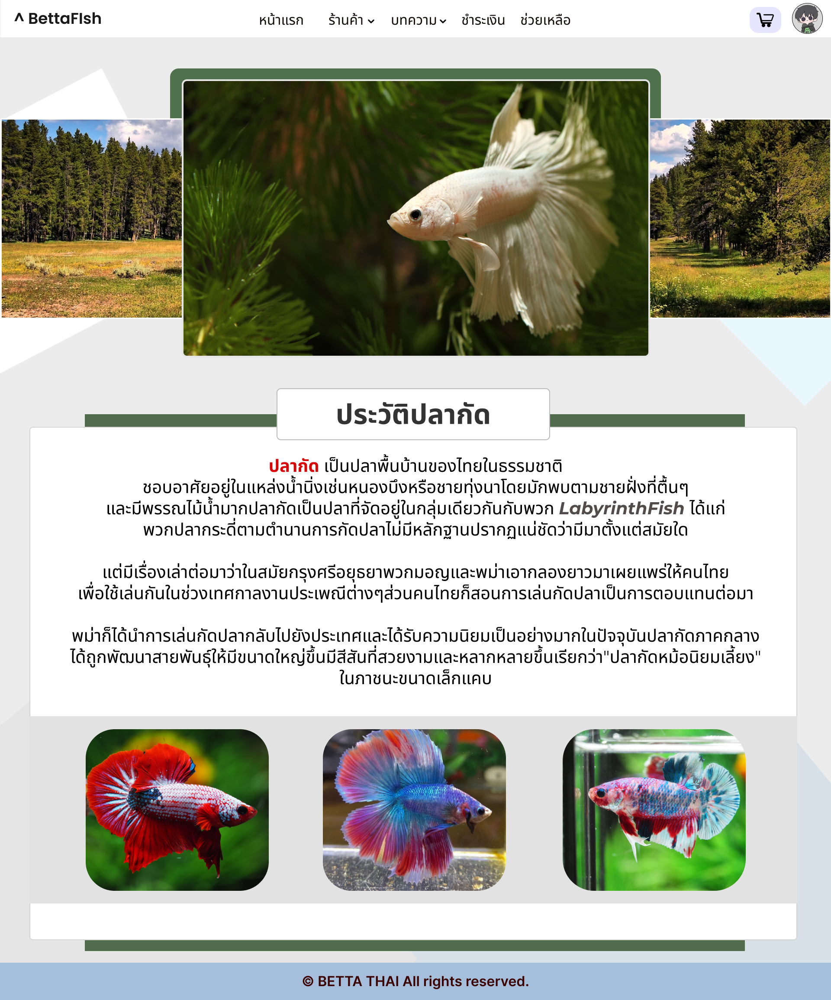
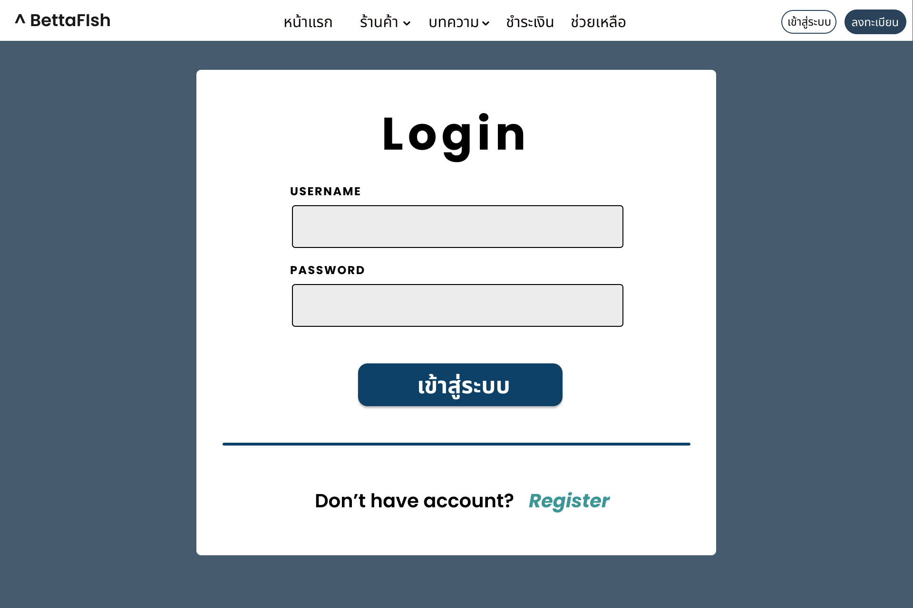
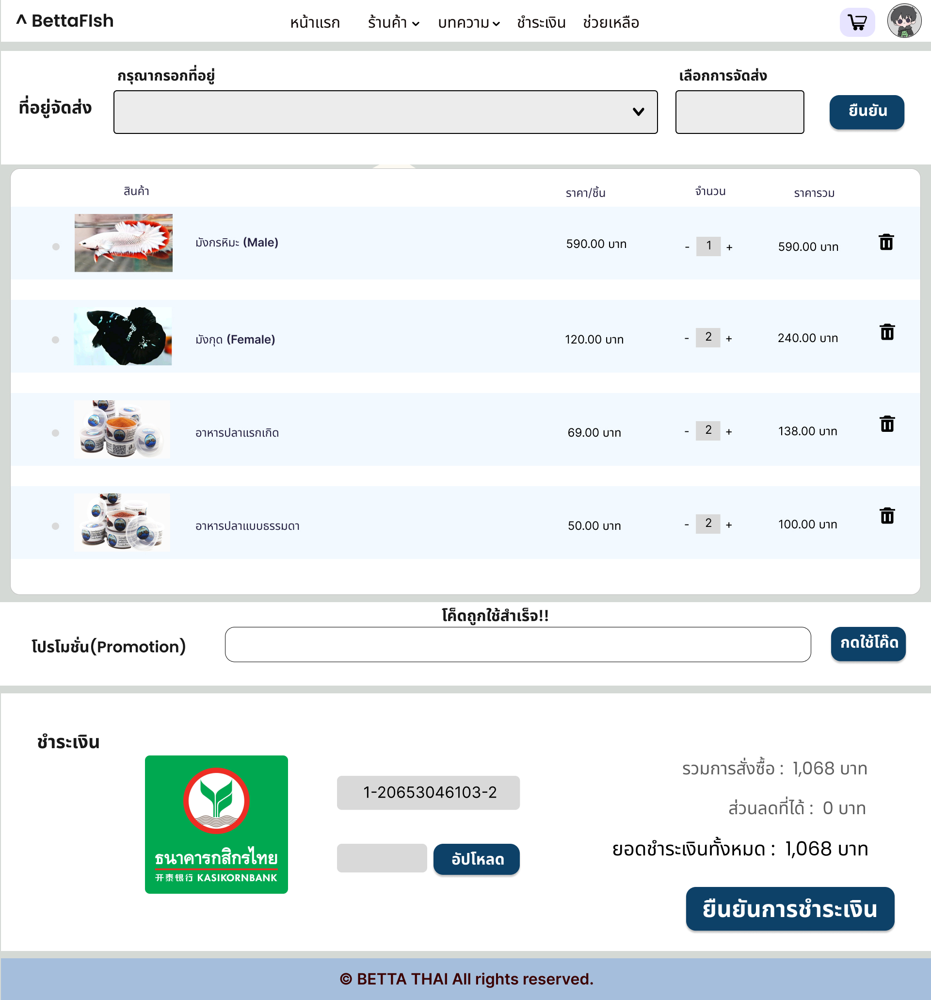
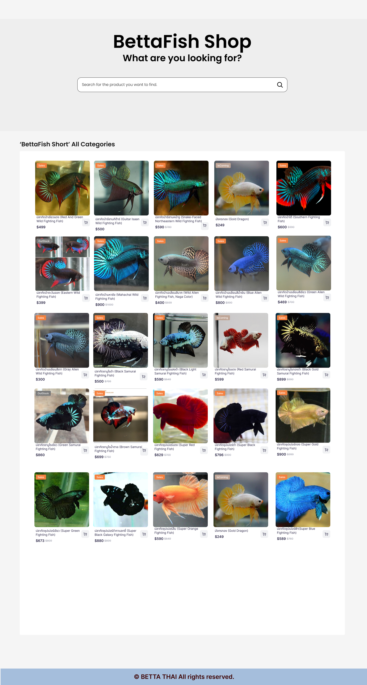
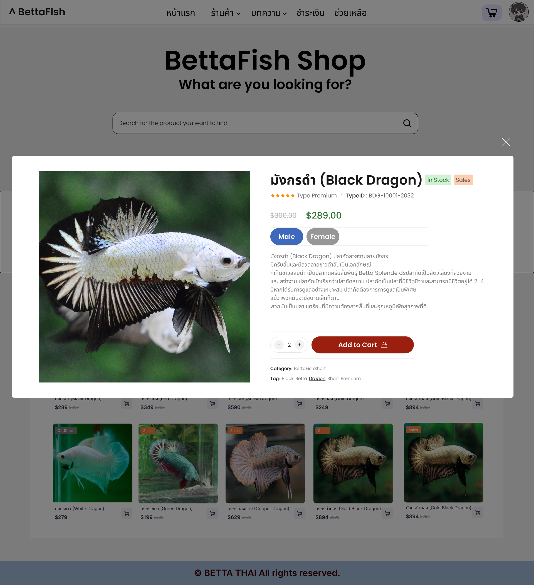
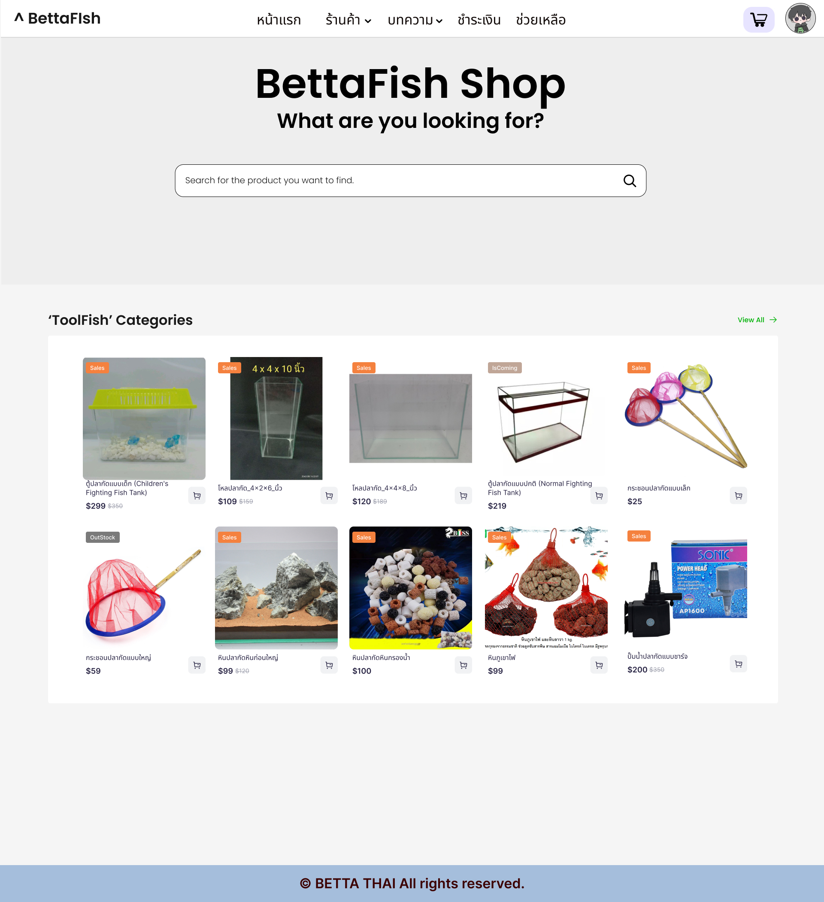

# 🐠 BettaFish Simple Website Project

**BettaFish_Project** is a Thai Betta fish e-commerce website developed using **ASP.NET**. The platform allows users to browse, view details, and purchase Betta fish through a clean and responsive user interface. It also includes an admin system to manage products and orders.

This project was developed as part of a university assignment in **Year 2, Semester 2**.

---

## 🚀 Key Features

- 🐟 **Product Catalog** – Display Betta fish with detailed information and images.
- 🛒 **Shopping Cart** – Add, update, and remove items with a persistent cart system.
- 👤 **User Authentication** – Secure login, registration, and session management.
- 📦 **Order Management** – Users can place and track orders; admins can manage them.
- 🧾 **Invoice Generation** – Simple order receipt for users.
- 🧑‍💼 **Admin Panel** – Manage products, prices, stock, and view customer orders.
- 🌐 **Responsive Design** – Optimized for desktop and mobile devices.
- 🔍 **Search & Filter** – Quickly find fish by name, price, or type (optional enhancement).

---

## ⚙️ System Architecture

The BettaFish_Project system consists of **3 main components**, each handling a key aspect of the application:

| Component           | Description |
|---------------------|-------------|
| **🌐 Web Frontend (ASP.NET)** | Website developed using ASP.NET Web Forms or MVC. Responsible for user interface, product browsing, shopping cart, and order placement. |
| **🗄️ Backend (ASP.NET / C#)** | Business logic and server-side processing implemented in C#. Handles user authentication, product management, order processing, and data validation. |
| **💾 Database (SQL Server)** | Stores product data, user accounts, orders, and other business data. Accessed through Entity Framework ORM. |

> These components are integrated within the ASP.NET ecosystem and communicate internally, forming a full-stack web application.

---

## 🔧 Tech Stack

### 💻 Frontend (ASP.NET)

- 💻 ASP.NET Web Forms / MVC
- 🎨 HTML5, CSS3, JavaScript
- 📦 Bootstrap (Frontend UI framework)

  ### 🌐 Backend (ASP.NET / C#)
- 🗃️ SQL Server
- 🔐 Entity Framework (Database ORM)

### 🎓 Academic Context

This project was developed as part of a third-year university course focused on:

- Web development using ASP.NET
- Database-driven e-commerce systems
- Frontend & backend integration
- Business-oriented web application design

---

## 📸 Screenshots (Placeholder)

> Add real UI screenshots here from the app (designed in Figma and implemented in Website)

| Main Screen | Register Screen | Article Screen | Login Screen | Cart Screen | Shop Screen | Shop Select Screen | Shop Tool Screen |
|-----------|--------------|--------|-----------|-----------|-----------|-----------|-----------|
|  |  |  |  |  |  |  |   | 

---

